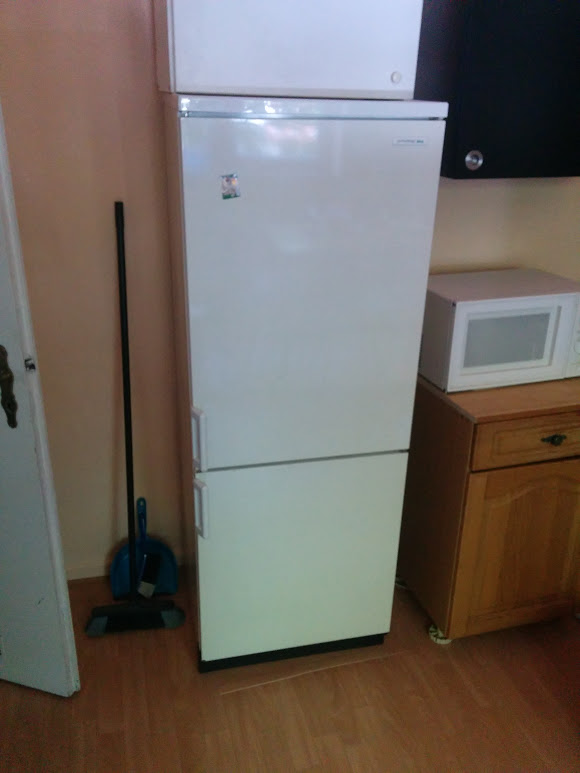

### 1.8.2015

haha 🐜 blabla 

|Tabelle|Kapelle|vh
|---|---
|Hi|Du

Vorgestern habe ich von Yogi die Email erhalten, dass ich mir bis Dienstag Techniken der 3D-Annotation anschauen soll und ihm darüber berichten soll. Eigentlich habe ich mir gedacht, hauptsächlich an der Synchronisation zu arbeiten um Y.js einzuarbeiten. Ich werd mit ihm am Dienstag darüber sprechen.

Lungenbeispiel:
- komplett ausblendbare Teile
- mitrotierendes Männlein, dass man weiß, wo vorne ist
- mit Tooltip und Text bei Mouseover
- http://liveranatomyexplorer.steven-birr.com/index.php?site=start

Herz in Falschfarben: http://www.julius-ecke.de/bilder/Anatomie/40_Innere-Organe/Herz.htm#.VbwQoJOUm1E

Herz mit Pfeilen http://www.transplantation-verstehen.de/dotAsset/25070.jpg

Aus dem ACIS-Blog
http://3dsa.metadata.net/3dsa/
mit beispielafter Annotationsdate:
http://3dsa.metadata.net/danno/annotea?w3c_annotates=http://3dsa.metadata.net/3dsa/annotator/service.php?modelID=0007_Roman_Sculpture_Male_Relief_Head[!-antiquities80-010-]

Außerdem:
http://3d.si.edu/

Da macht schon jemand was in die Richtung?
http://vermeer.informatik.rwth-aachen.de:4080/ATLAS/tiki-index.php?page=Web-based+Collaborative+3D+Objects+Annotation

### 12.8.2015

http://examples.x3dom.org/example/x3dom_uiEvents.html

Erste Ideen:

- Punkte mit Durchmesser
- Linie zum Rand mit Beschriftungen
- Linien jeweils in unterschiedlicher Farbe
- Die Teile nicht bei mouseover sondern mit einem Picker-Element
- Enable/Disable der Beschriftungen
- Annotation setzen mit Picker-Element
- Demut üben :(
- Picker-Element zum Lesen der Annotationen in besonderem Modus
- Hervorheben der Annotationen bei Annäherung des Picker-Elementes
- Neu setzen durch Picker-Element mit anschließendem Slider (Ø)

Zum schnelleren Nachvollziehen:

Annotation setzen:
- View in richtige Position bringen
- Das Picker-Element aufnehmen:
	- View-Änderungen sind ausgeschaltet
	- Alle vorhandenen Annotationen werden sichtbar
	- Neue Randelemente werden sichtbar, mit Animation "Sog"
	- Wo das Picker-Element vorher war, wird ein größerer Kreis sichtbar, wo man das Element wieder ablegen kann
- Beim Eintauchen in Randelement:
	- Form oder Farbe ändert sich
	- kurze Animation "Splash"
    - Picker-Element verändert sich permanent
- Das Picker-Element wird auf Nichtobjekt gedroppt
	- Prozedur wird beendet
- Das Picker-Element auf die gewünschte Stelle droppen:
	- Aufruf zum Speichern
	- Warteanimation wird eingeschaltet
	- Randelemente werden unsichtbar
	- "Save..."/"Saved"-Logo wird eingeblendet
- Positive Antwort
	- kurze Animation "Light-Splash"
	- Randelemente werden anklickbar, Animation der Randelemente ändert sich
	- Am Rand erscheint eine Textbox mit Default-Text "Der Knochen ist..."
	- Logo auf "Saved" setzen
	- Grafische Elemente für Durchmesser/Pfeilrichtung/... werden sichtbar
- Bei Klick auf die nun gesetzte Annotation fängt obige Prozedur wieder an
- Parameter ändern
- In der Textbox Text eingeben
	- Live-Abspeicherung mit Verwendung "Save..."/"Saved"

Annotation bearbeiten:
- Der Text der Annotationen muss dafür sichtbar sein
- Der Text einer Annotation wird angeklickt
	- wie bei setzen, nur dass das Element schon "gedroppt" ist
- An den Parametern drehen

Es sieht so aus, dass eine state-machine dafür ganz praktisch ist. Hier ist eine Forumsdiskussion dazu:
http://stackoverflow.com/questions/13262392/javascript-event-state-machine
Ich mache zuerst das UML-Diagramm und schau dann, welche Funktionalität ich von der State-Machine brauche (z.B. "onEnter()").

### 29.8.2015

Die State-Machine ist in ihrer ersten Fassung fertig. Habe gedacht, ein Object-Diagram oder ein Class-Diagram zu machen. Bei der Erzeugung hat man allerdings einige Einschränkungen, sodass es sich bei der kleinen Menge nicht lohnt. Deshalb werde ich die Klassen textuell beschreiben.

Hier ein erster Versuch, die benötigten Funktionalitäten aus der State-Machine in Klassen zu packen. Die State-Machine bleibt zentraler großer Baustein:

singleton **AnnotationBase**
- Fields
	- modelId
	- entryList
- Interface
	- init()/create()
	- changeModel( newModelId )
	- Iterator_AnnotationBaseEntry getIterator()
- Task
	- synchronizing with database
	- expose interface for retrieving and updating annotations

**AnnotationBaseEntry**
- Fields
	- all annotation-related information
- Interface
	- update( key, value, savedCallback )
	- addListener( newListener )
- Task
	- annotation data-manipulation

singleton **AnnotationDisplayer**
- Fields
	- x3dscene
- Interface
	- init( AnnotationBase )/ create( AnnotationBase )
	- showText()
	- showPinsOnly()
	- showNothing()
- Task
	- show the annotations in the 3D-viewer

**AnnotationParameterConfigurator**
- Fields
	- annotationEntry
	- dom_div //later maybe x3dscene
- Interface
	- init()/ create()
	- show()
	- hide()
- Task
	- GUI for editing annotation
	- listening for annotation-data changes

instance **ColorShapeConfigurator** : *AnnotationParameterConfigurator*
- Fields
	- Icons and animation
	- stateVariable (has state "Dragging Picker-Element" and "Editing Annotation-Values")
- Functions
	- changeToDraggingState()
	- changeToEditingState()

instance **ExtendedConfigurator** : *AnnotationParameterConfigurator*
- Fields
	- Icons and animation

instance **TextConfigurator** : *AnnotationParameterConfigurator*

>

Beim Aufschreiben ist mir aufgefallen, dass es zwei Alternativen für ein Problem gibt:
- Problem
	Manche Objekte sind nachher vom aktuellen Zustand der State-Machine abhängig
- Lösung 1
	Die Objekte können auf die State-Machine zugreifen oder haben einen Listener registriert
    - Vorteil
    	Die Daten sind gekapselter
    - Nachteil
    	Das Verhalten ist indikrekter von der Dokumentation implementiert
- Lösung 2 ✓
	Die State-Machine greift ständig auf die Objekte zu und verándert deren Zustand
    - Vorteil
    	Die Dokumentation ist sichtbar implementiert
	- Nachteil
		Die Objekte sind nicht mehr so gekapselt und man muss ständig mit der State-Machine arbeiten

Das Problem resultiert auch ein wenig daraus, dass die State-Machine das grafische Verhalten sehr detailliert spezifiziert:
- Vorteil
	- Man weiß konkret, wie die GUI nachher aussieht
	- Die Dokumentation ist kompakt (Verständnis,Änderungen,Anzahl Dateien)
- Nachteil
	- Kleine grafische Änderungen müssen entweder direkt dokumentiert werden oder die Dokumentation wird inkonsistent

Weil die Webseite nachher eventuell von Neuzugängen weiterentwickelt werden soll, entscheide ich mich für Lösung 2. Die State-Machine wird dann DER Einstiegspunkt, um die Annotations-GUI zu modifizieren. Außerdem brauche ich dann einen Vermerk, der sagt, die State-Machine immer aktuell zu halten und den Grund für die Entscheidung irgendwo zu erwähnen.
Alles was nicht in der State-Machine dokumentiert ist, weil es selbstverständlich ist oder für das Look&Feel irrelevant ist, kann ja immer noch von den Objekten gehandelt werden (z.B. listening für Annotations-Änderungen). Sobald es in der State-Machine auftaucht, sollte es auch in der State-Machine implementiert werden. Die Hauptfunktion der State-Machine ist also: Look&Feel spezifizieren+dokumentieren, so grob, dass es auch ein Nichtprogrammierer versteht und so detailliert, dass die Fantasie genug Informationen hat.
